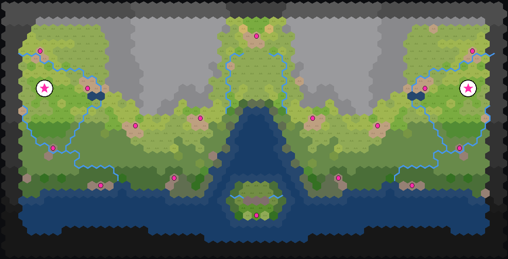

# MapGen_CalderaBay

A custom **Old World** map script: **Caldera Bay** — a competitive, mirror-symmetric
duel map built around a drowned river estuary.



> **[Browse twelve generations in the live atlas →](https://alcaras.github.io/MapGen_CalderaBay/atlas/)**

## The map

A drowned river estuary. A northern **mountain range** sheds rivers south across a
coastal plain into a central **bay** (the drowned trunk-river valley, breaching the
range through a water-gap). Foothill **spurs** finger south, splitting each half into
lanes and passes. The estuary floodplain is a **marsh-or-desert moat** ringing the
contested middle. A **volcanic island** sits in the bay as a neutral prize, and a
**mountain city** in the highlands is a second prize to fight over.

It is always generated at its own **wide duel size (64×43) · mirror** — a fair 1v1: everything west of
centre is mirrored east, so neither player has a terrain or resource edge.

### Designed-in features

- Engine-flowed **rivers** that drain downhill into the bay (real `GenerateRivers`).
- Realistic **climate** — mostly temperate, lush hugging the rivers/coast, arid moat.
- Natural **forests/scrub**, city sites, urban founding tiles and resource density —
  all the engine's own work; the script overrides only land-shaping and then enforces
  mirror symmetry.
- **Tribes**: one diplomacy tribe per player (a *different* one each side, at mirror
  positions), and one tribe alone in the contested centre. Horse tribes are paired
  (if one side is Scythian/Numidian the other is too); barb-vs-tribe site counts match
  per side; **Huns** appear in the centre only when the engine actually rolls them, and
  never on a player's side.
- **"Climate (latitude)"** New-Game option: Random / Mediterranean (warm) /
  Temperate / Northern (cold tundra).

## Install (players)

Grab [`CalderaBay.zip`](CalderaBay.zip) and unzip the `CalderaBay` folder into your
mods directory:

- **Windows:** `%USERPROFILE%\AppData\Roaming\OldWorld\Mods\`
- **macOS:** `~/Library/Application Support/OldWorld/Mods/`

Then: Old World → **Mods** → enable *Caldera Bay* → New Game → map **Caldera Bay**
(smallest, 2 players; turn Mirror on for hotseat/MP).

## Build (developers)

```sh
dotnet build src/CustomMapScript.csproj -p:GameDir="/path/to/Old World"
# copies the DLL to mod/CustomMapScript.dll; mod/ is a loadable Old World mod
```

- `src/CalderaBay.cs` — the map script (`MapScriptCalderaBay : DefaultMapScript`).
- `mod/` — the loadable mod (ModInfo, Infos XML, compiled DLL).
- `tests/test_caldera_bay.py` — a structural red-green spec (builds the DLL, generates
  a map headlessly, asserts the design holds). Run: `python3 tests/test_caldera_bay.py`.
- `atlas/` — a static viewer rendering twelve generations for fast iteration.

Headless generation uses [`owmapgen`](https://github.com/alcaras) — `--script CalderaBay
--size smallest --players 2 --aspect-ratio wide --mirror`.
